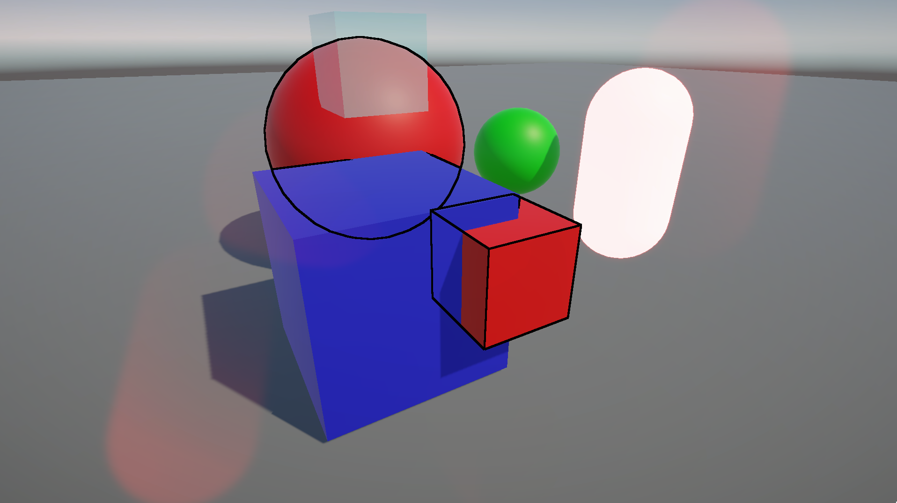

# URP Render Features

Various custom render features for unity 6.
These features are written with URP Version 17.0.3 using RenderGraph and include RendererLists and the Blitter API.

A big help was [this](https://www.cyanilux.com/tutorials/custom-renderer-features/) blog post by Cyanilux and looking at
how unity implemented some of their sample render features.
These can be found in the URP package under samples.

## Outline Render Feature

The outline render feature is taken from [Robinseibold](https://github.com/Robinseibold/Unity-URP-Outlines/)
implementation of [Erik Roystan Ross Outline Shader](https://roystan.net/articles/outline-shader.html).
I've made some major adjustments to make it compatible with newer urp versions and the RenderGraph api.
You can control which objects receive outlines by specifying LayerMasks and RenderLayers.

You can modify if the outlines should be hidden behind other object or render through.

|                Hidden                 |                 Showing                  |
|:-------------------------------------:|:----------------------------------------:|
|  |  |

## Desaturation Render Feature

Similar to the outlines this feature can be controlled by using LayerMasks and RenderLayers.

**NOTE: The is current version is not updated to use the RenderGraph for this feature.**

## Blur Render Feature

This was take and adapted from Unity's documentation
tutorial [here](https://docs.unity3d.com/Packages/com.unity.render-pipelines.universal@16.0/manual/containers/create-custom-renderer-feature-1.html).

**NOTE: The is current version is not updated to use the RenderGraph for this feature.**