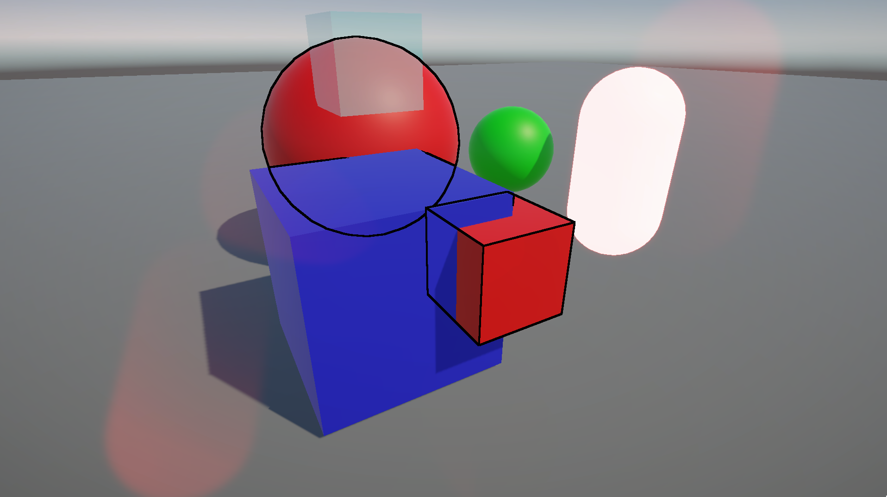

# URP Render Features

A small collection of custom **Universal Render Pipeline (URP)** renderer features. The main goal is to make a couple of
common “selective effects” (outlines, desaturation, etc.) easy to apply to *only some* objects, while staying compatible
with newer URP versions and the **RenderGraph** workflow.

## Requirements

- **Unity 6 or newer** (minimum)
- **Universal Render Pipeline (URP)** enabled for your project

> Note: This package is URP-specific and won’t work with the Built-in Render Pipeline or HDRP.

## Included Features

### 1) Filtered Fullscreen Render Feature

This feature renders a *filtered subset* of objects into an intermediate texture, then runs a standard fullscreen pass
using that texture as input.

**Filtering options**

- **LayerMask**
- **Rendering Layers** (RenderLayers)

**What you can do with it**

- Outlines on specific objects
- Desaturation / tint / highlight effects
- Any custom effect you can express as a material/shader in a fullscreen pass

### 2) Outlines (Example Use Case)

|                Hidden                 |                 Showing                  |
|:-------------------------------------:|:----------------------------------------:|
|  |  |

### 3) Desaturation (Example Use Case)

Like the outlines setup, desaturation can be limited to specific objects using **LayerMask** and **Rendering Layers**.

## How it Works (High Level)

1. **Filtered pass**: render only the selected objects into a texture (optionally with a replacement material).
2. **Fullscreen pass**: run a fullscreen material that reads the filtered texture and composites the final result to the
   camera target.

This separation makes it straightforward to target only certain objects without affecting the whole scene.

## Setup (Typical Workflow)

1. Ensure your project uses **URP** and you have a URP Renderer Asset in your pipeline settings.
2. Add the renderer feature(s) to your URP Renderer Asset:
    - Open the Renderer Asset in the Inspector
    - Click **Add Renderer Feature**
    - Select the feature you want to use
3. Configure filtering:
    - Set the **LayerMask** and/or **Rendering Layers** so only intended objects are included.
4. Assign or tweak the material used for the fullscreen pass to get the desired effect.

## Credits / References

- Cyanilux tutorial on renderer features: https://www.cyanilux.com/tutorials/custom-renderer-features/
- Original outline feature inspiration:
    - Robinseibold’s URP outlines: https://github.com/Robinseibold/Unity-URP-Outlines/
    - Erik Roystan Ross outline shader article: https://roystan.net/articles/outline-shader.html
- Also informed by Unity’s official URP sample renderer features (found in the URP package samples).

## Contributing

Issues and PRs are welcome—especially for:

- Additional example effects built on the filtered fullscreen approach
- Compatibility fixes across URP/Unity minor versions
- Documentation improvements (more screenshots, clearer setup steps)

## License

MIT License. See [LICENSE](LICENSE).